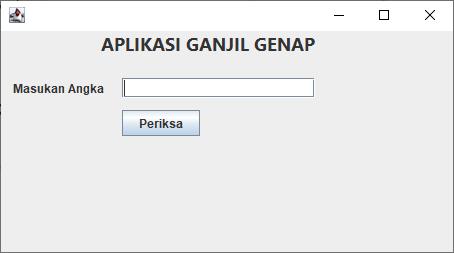
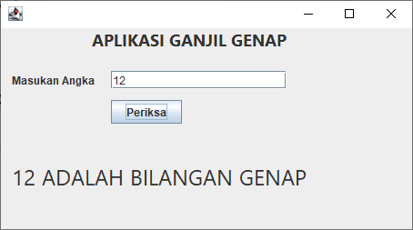
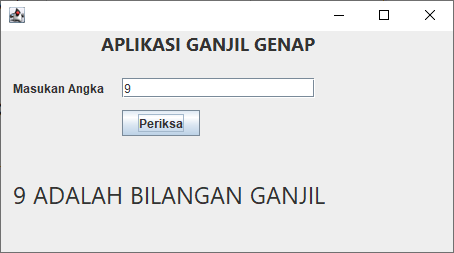
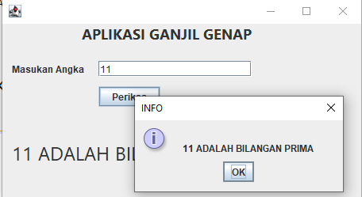
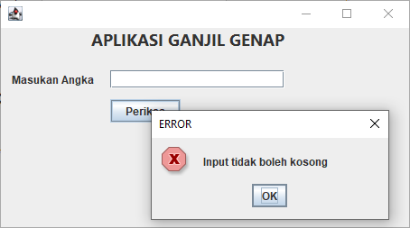
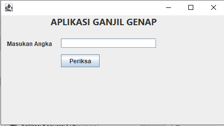

# TUGAS 01 - APLIKASI GANJIL GENAP

## My Bio
NPM: 2210010097  
Nama: Muhammad Junaidi  
Kelas: 5B TI Reg BJB  

## DEMO
1. Aplikasi Ketika awal dibuka  

2. Diinputkan bilangan Genap  

3. Diinputkan bilangan Ganjil  

4. Diinputkan bilangan Prima  

5. Klik Tombol ketika input field masih kosong  

6. Ketika cursor fokus pada input field maka field input dan label untuk menampilkan hasil akan kosong  

